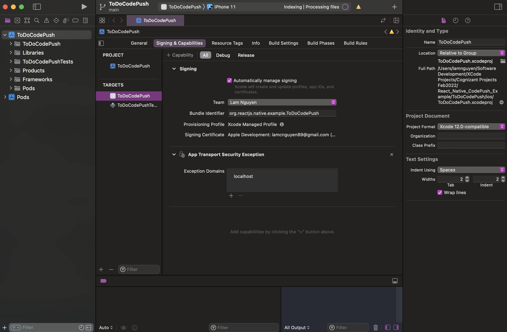
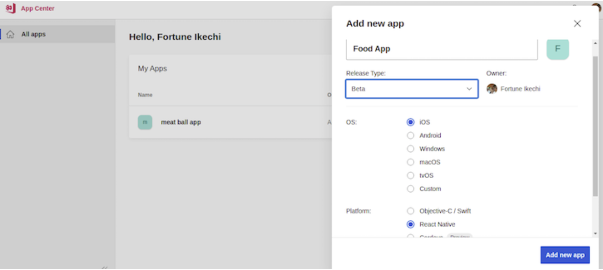
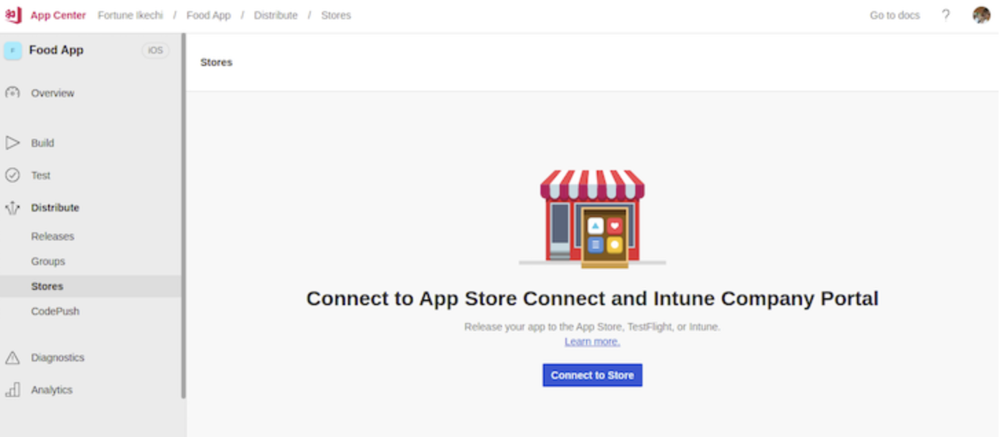
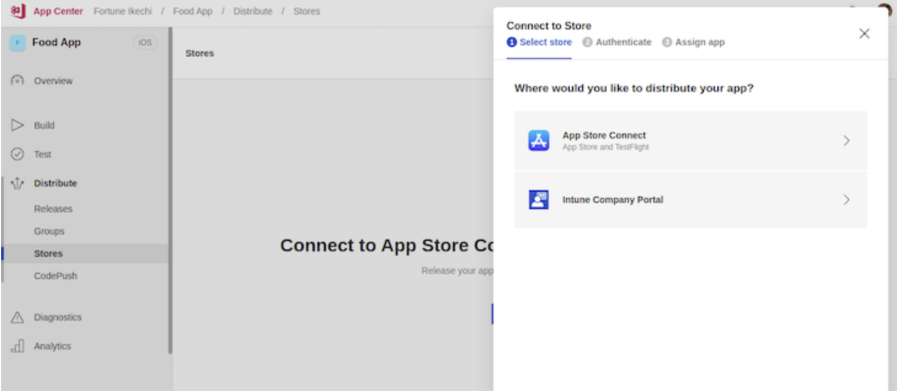
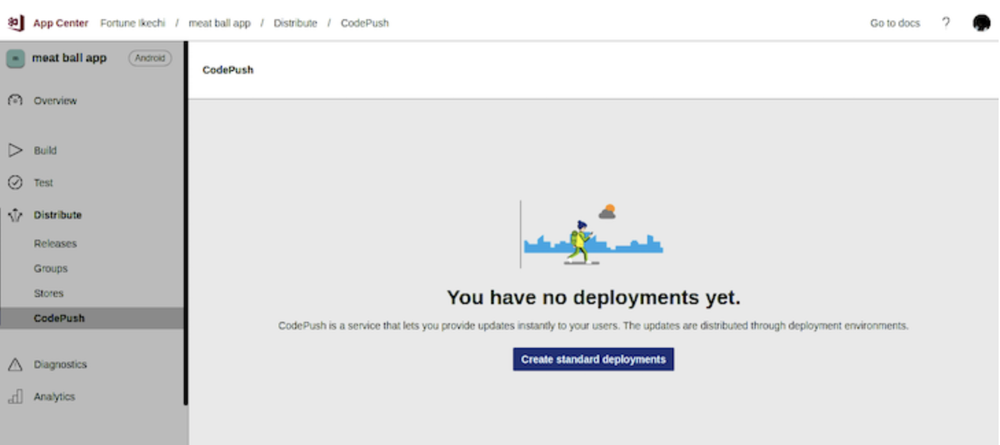
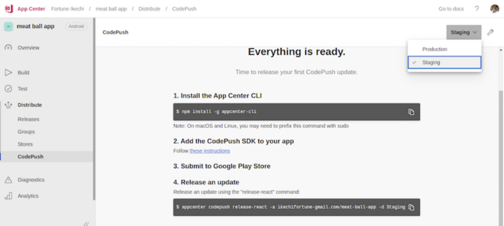
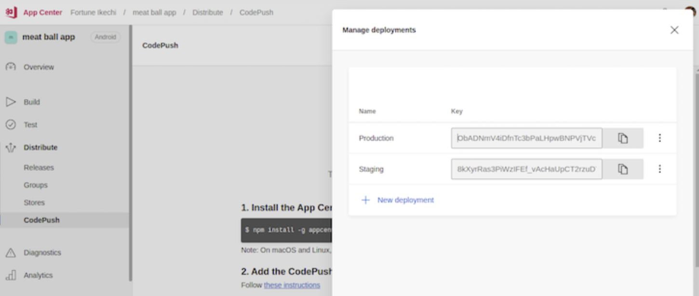
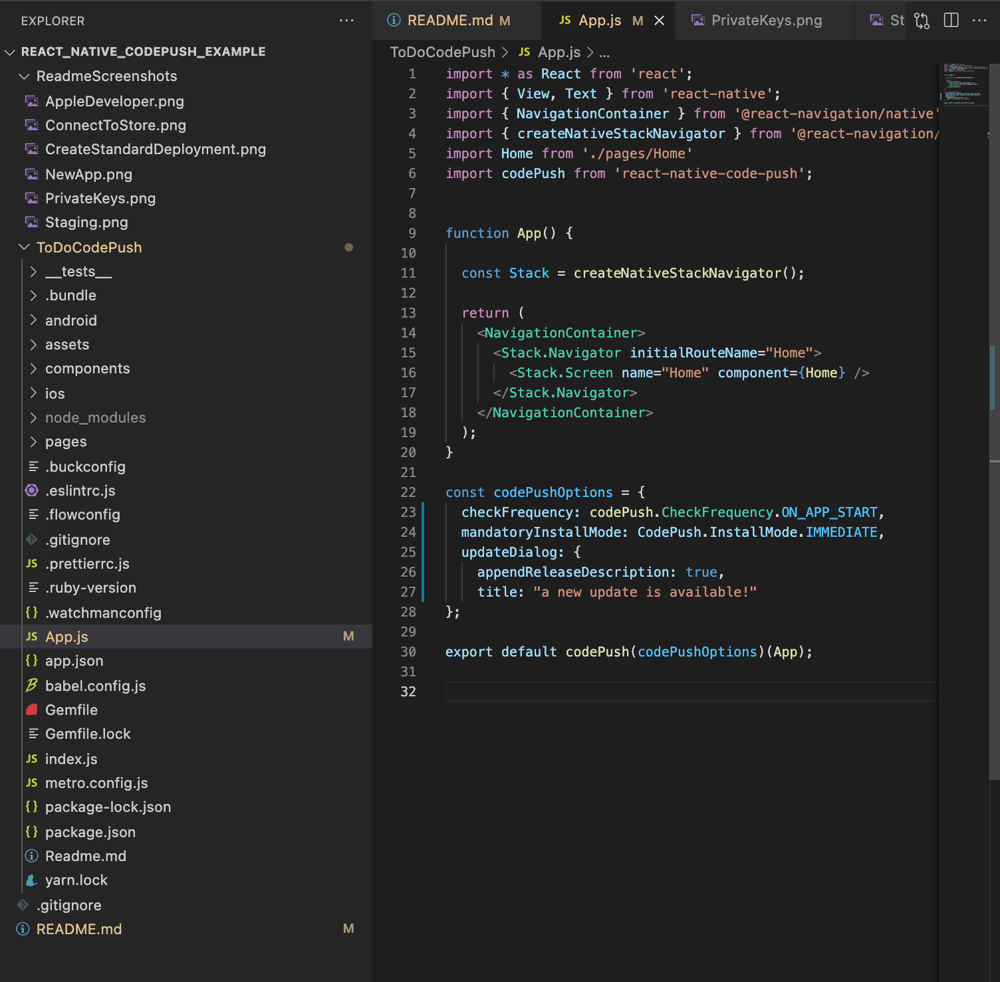

# React_Native_CodePush_Example

[](http://unlicense.org/)

This application is a demonstration for the code required to use Codepush technologies. It is a simple To Do application designed in React-Native. However the codepush portion of the code can be applied to any app designed with React-Native.

The following Document will discuss what Codepush is and how to implement it into an Application.

## What is Codepush?

Codepush is a cloud computing service created by Microsoft. It allows mobile developers to push updates directly to end users in production without having to go through the Google Play Store or iOS App Store. Codepush allows for:

1. Faster and more efficient updates, testing, and bug fixes for an app. 
2. Analytics for things such as release adoption rates, rollbacks, and installs
3. The ability to test an app on real devices of various types quickly.
4. Monitor app health and identify the root causes of issues quicker.
5. Targeted deployments or the ability to deliver updates to different demographics

So far, the Codepush technology is designed for apps developed with the React-Native or Apache Cordova languages.


## How to Install and Use this Application on Mac using React Native CLI:

1. If not already installed, install Homebrew:

    /usr/bin/ruby -e “$(curl -fsSL https://raw.githubusercontent.com/Homebrew/install/master/install)"

2. If not installed, install Node.js:

    brew install node

3. Install Watchmen:

    brew install watchman

4. Install React-Native CLI:

    npm install -g react-native-cli

5. Install XCode:

6. Install Xcode Command Line Tools:

    Open Xcode -> Preferences -> Locations tab -> install the latest version of Xcode command line tools.

6. Go into the root of the downloaded project folder and install package dependencies:

    npm install

7. Still in the root of the project folder, install the pods (package dependencies) for the mac section of the project:

    npx pod-install ios

8. In the root of the project folder, navigate to the ios folder and open the file named ToDoCodePush.xcworkspace in XCode. Go to the 'Signing and Capabilities' menu for the project. Select your Team for the project. In order to add a team, you have to sign in with your apple account in XCode preferences.

9. From the Root of the folder, navigate to the iOS section and open the ToDoCodePush.xcworkspace file in XCode. As per the screenshot below, go to the "Signing and Capabilities" Section and make sure you have a Team selected. By default it will most likely be your Apple Account. 



10. In the terminal, go back to the root of the project folder and run the project by typing in the terminal:

    react-native run-ios

11. Another way to run the project is to go into the IOS folder in the root of the project and open the file named:

    ToDoCodePush.xcworkspace

12. Make sure to open the .xcworkspace file NOT the .xcodeproj file. Otherwise the project will not be able to load the pod file dependencies and building the project will fail.


## How to convert a React-Native App to be able to use the Codepush Technology:

There are two main tasks to complete in order to implement Codepush into a React-Native App.These parts are:

1. Setup a Deployment on Microsoft's Cloud Computing Service.
2. Setup the code on your React Native Application

## Setup Deployment on Microsoft's Cloud Computing Service

Ideally, you want your application to be already deployed to the app store, but it isn't necessary. 

1. If you haven't already, create an account on Microsoft's [Appcenter](https://appcenter.ms/sign-in?original_url=%2Fapps).

2. In the AppCenter, create a new application and select the "Add new app".

3. Name your application and select the type of release: Production, Beta or 
Store.



4. Select the OS and platform you are developing for.

5. Once these details are completed, click the "Create new app" button.

6. To distribute your React Native App in either the iOS App Store or Android Google Play Store, Navigate to the "Distribute" section of your AppCenter dashboard, click on "Stores" and connect your application to the store.



7. To launch your app on iOS, you'll need to register Apple Developer



## Creating Standard Deployments on AppCenter

1. Navigate to Codepush from your application dashboard and click on "Create Standard Deployments"



2. In the top Right Corner of your AppCenter dashboard, select "Staging" as your application environment.



3. Once you've selected the application environment, click on the settings icon on the right side of your dashboard to reveal your application's private keys:




## Adding Codepush to React-Native

1. Go to the root of the React-Native application. You know you are in the root if you see a package.json file.

2. Open a terminal in the root and use one if the commands below depending on which package manager you have installed on your system

    ```
    yarn add react-native-code-push

    ```

    ```
    npm i --save react-native-code-push
    ```

3. Next we install Codepush pods into the native iOS project using the commands below

```
cd ios
pod install 
cd ..
```

4. Within the native iOS project, navigate to the "AppDelegate.m" file and import CodePush headers into your file:

```
import <CodePush/CodePush.h>
```

## Initializing CodePush in React Native

To initialize Codepush, you wrap the root component with a higher order component provided by the CodePush Module. You can also a some different CodePush options, like the ability to display live updates to users.



## Deploying App Updates with CodePush

To release updates on a React Native app using CodePush, we have to install the App Center CLI package.

1. Navigate to the root of your project where the "package.json" file is located, open a terminal in the root directory and enter one of the following commands depending on which package manager you are using:

```
yarn global add appcenter-cli
```

```
npm install -g appcenter-cli
```

2. After installing the App Center CLI package, login using the command below:

```
appcenter login
```

3. Now we can release CodePush updates using the code below:

```
appcenter CodePush release-react -a {user}/{app name} -d {environment}
```

Note the "user" and "app name" can be found on the AppCenter. The "user" is most likely the login username when you log onto the AppCenter service. 

The "Environment" is either Production, Staging etc... Look in the docs linked in the resources below.


## Resources:

- [The blogpost I used to help implement Codepush](https://blog.logrocket.com/implementing-codepush-react-native/)
- [YouTube Video Series I used to help implement Codepush](https://www.youtube.com/watch?v=jEEPlqIcICM&list=PLucG_ap4OxzhOGhcO4pJxm-ojSV5LMHWi)
- [Microsoft AppCenter](https://appcenter.ms)
- [CodePush Documentation](https://docs.microsoft.com/en-us/appcenter/distribution/codepush/)
- [The blogpost I used to help implement Codepush](https://blog.logrocket.com/implementing-codepush-react-native/)


 
## Prerequisites and Deployment

- Mac for Xcode and iOS testing
- AppCenter login and Registration
- Windows, Linux or Mac for React-Native Development

## Built With

- Xcode
- React-Native
- Visual Studio Code
- Microsoft App Center


## Author

**Lam Nguyen**

## License

The Unlicense


